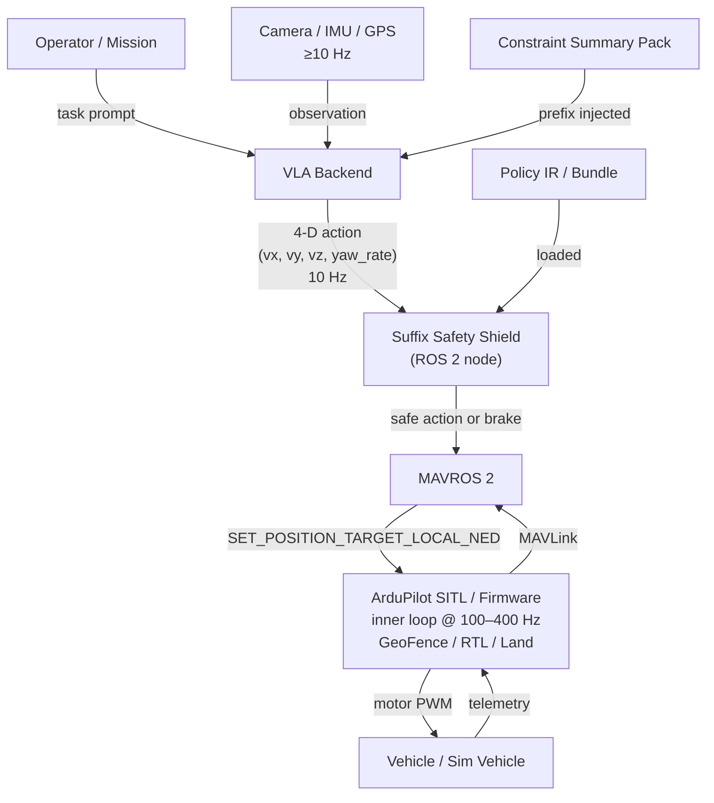

# Architecture constraints

The choices in this section are **locked inputs** to the simulation framework decision. They are not re-debated here; they are listed so any reader can audit whether the simulator survey actually serves them.

## Hierarchical control pattern

The VLA does not drive motors directly. It emits a 10 Hz setpoint that ArduPilot's inner loop tracks at 100–400 Hz. The Suffix Safety Shield sits between the VLA and MAVROS 2 and is the last software layer before the autopilot. The autopilot's own GeoFence / FENCE_ACTION is the *ultimate* backstop — the Shield does not replace it, it pre-empts it.



## Action space

The 4-D action space contract is:

```
a = (vx, vy, vz, yaw_rate)    # body-frame velocities + yaw rate
```

This is the **Shield's input contract** — projection operators in the Safety Shield act on this 4-D space, not on waypoint-shaped actions. The shape is consistent with **CognitiveDrone** (an OpenVLA-7B drone fine-tune), which serves as the baseline reference for the action space — not as the chosen default backend. The VLA backend interface is switchable (CognitiveDrone, OpenVLA generic, BitVLA, in-house stubs for unit tests, etc.); every backend must conform to this 4-D output shape, but the project does not commit to any one of them as a "default" until the Q2 measurement set lands.

## VLA / autopilot interface

| Layer | Rate | Protocol | Notes |
|---|---|---|---|
| VLA → Shield | 10 Hz | ROS 2 topic (`std_msgs/Float32MultiArray` or custom 4-D msg) | Source of truth for the 4-D action |
| Shield → MAVROS 2 | 10 Hz | ROS 2 topic (`mavros_msgs/PositionTarget`) | Already filtered/projected |
| MAVROS 2 → ArduPilot | 10–50 Hz | MAVLink `SET_POSITION_TARGET_LOCAL_NED` | UDP 14550 |
| ArduPilot inner loop | 100–400 Hz | internal | Bit-identical between SITL and firmware |
| ArduPilot → Mission Planner | telemetry | MAVLink via `mavlink-router` | Parallel to MAVROS |

## Safety path: MAVROS 2 first

For Year 1, MAVROS 2 is the canonical bridge. AP_DDS (ArduPilot's native DDS support) is technically attractive but is treated as a **Q3 optional migration**, not a blocker for the mid-term delivery.

Rationale: MAVROS 2 has battle-tested parameter handling, GeoFence I/O, and mission-item plumbing. AP_DDS coverage is improving but uneven across topics needed by the Shield.

## Three deployment topologies

The same code base must run in three configurations. All three are first-class — none is a degraded mode.

| Topology | What runs where | Purpose |
|---|---|---|
| **dev** | Everything on a single desktop (incl. ArduPilot SITL, Gazebo, Project AirSim, MAVROS, Shield, VLA stub or quantized backend) | Fast iteration, CI, unit/integration testing |
| **hil** | Desktop runs sims + MAVROS + GCS; Jetson Orin runs VLA + Shield over network | **Canonical KPI configuration** — what every reported number is measured against |
| **flight** | Orin runs VLA + Shield as a companion computer alongside real ArduPilot autopilot | Closest to the AI Wings real-flight stack; final demos |

Project AirSim is **always desktop-resident** in every topology — Unreal Engine 5 needs a discrete NVIDIA GPU, which the Orin doesn't have. See [Topologies](../03-simulation/topologies.md) for the diagram and per-topology component layout.
