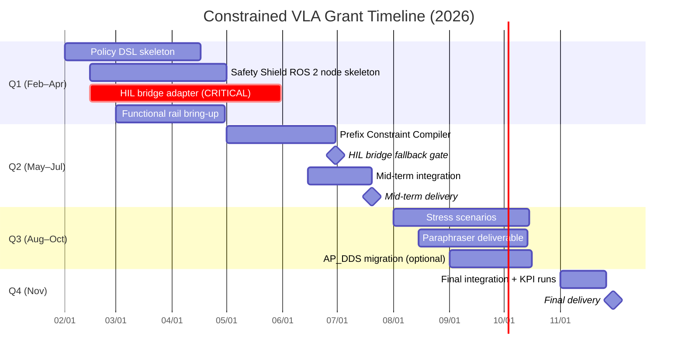

# Grant overview

## Identification

- **Programme:** ITRI ICL 115-year subcontract / collaborative research, public notice no. 5.
- **Title:** Semantic-Spatial Translation and Safety-Constrained VLA for ArduPilot UAVs.
- **Period:** 2026-02-01 – 2026-11-30 (Republic of China year 115).
- **Budget:** NT$ 1,012,000.
- **PI:** Kuan-Ting Lai, NTUT AIoT Lab.
- **Personnel:** 1 PI + 4 Master students (two on ArduPilot/MAVLink, two on VLA fine-tuning / prompt engineering).

## Work packages

ITRI defines the top-level system spec; NTUT executes WP1 through WP4.

| WP | Title | Output artefact | Owns these KPIs |
|---|---|---|---|
| **WP1** | Policy / constraint IR / DSL | YAML/JSON DSL → IR/AST; signed policy bundle (hash + semver) covering GeoFence, envelope, corridor, time windows, breach actions | Policy load round-trip; bundle replayability |
| **WP2** | Prefix Constraint Compiler | Constraint Summary Pack (CSP) injected into VLA / planner prefix | Prefix-token budget; CSP coverage of policy IR |
| **WP3** | Suffix Safety Shield | ROS 2 node: Monitor / Filter / Projection; MAVLink → ArduPilot fence / RTL / Land / Loiter as ultimate backstop | **P0 violation escape rate (target 0)**; **fail-safe trigger correctness**; **mean repair magnitude**; **mean time to safe** |
| **WP4** | Dynamic-scenario stress testing | Scenario library; KPI rollups; replay harness | Mission success rate; per-paraphrase robustness |

The sub-step-level implementation breakdown for each component lives in the [Implementation plan](../02-implementation/overview.md) section.

## Acceptance KPIs (explicitly listed)

1. Mission success rate (任務成功率).
2. **P0 violation escape rate — target 0.**
3. Fail-safe trigger correctness.
4. Mean repair magnitude.
5. Mean time to safe.

## Delivery dates

The two dates below are **hard contractual acceptance gates**.

| Date | Item | What ships |
|---|---|---|
| **2026-07-20** | Mid-term delivery | Policy DSL + IR; Safety Shield ROS 2 node skeleton with at least one projection operator; functional rail (Gazebo Harmonic) demoable end-to-end |
| **2026-11-30** | Final delivery | Policy DSL, Prefix Compiler, Safety Shield, and Stress Testing complete; KPI report on dynamic-scenario stress; perception-rail integration; signed final report |

## Timeline

## Locked architectural constraints

These are not re-litigated in this report; they are inputs to the simulation choice.

- **Hierarchical control:** the VLA outputs a setpoint or mission item; ArduPilot runs the inner loop at 100–400 Hz. End-to-end motor-PWM VLAs are out of scope for this grant.
- **Action space:** 4-D `(vx, vy, vz, yaw_rate)`. This is the Safety Shield's input contract — projection operators in the Safety Shield act on this 4-D space, not on waypoint-shaped actions. The shape was chosen for compatibility with current drone-VLA work (CognitiveDrone is one such baseline reference); the project does not commit to a specific backend as the "default".
- **Safety path:** MAVROS 2 first; AP_DDS migration is a Q3 optional, not a blocker.
- **GCS:** Mission Planner via `mavlink-router` fan-out (parallel to MAVROS), not as a serial bottleneck.

See [Architecture constraints](architecture-constraints.md) for the diagram.
