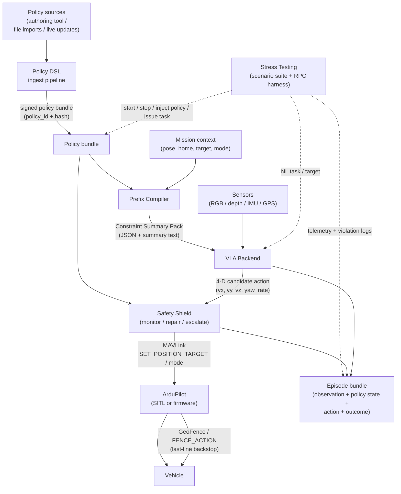

# Implementation overview

This section captures the implementation plan for the four-component system the grant ships: a Policy DSL, a Prefix Compiler, a Safety Shield, and a Stress Testing harness. Sub-design for each component is being authored over the coming weeks; per-page **Open questions** sections track what is still unresolved and need direction from the PI before depth can be added.

## What gets built

| Component | Page | Goal |
|---|---|---|
| **Policy DSL** | [policy-dsl.md](policy-dsl.md) | Unify all safety / policy constraints (GeoFence, envelope, corridor, time windows, breach actions) into a versioned, validatable form shared by the Prefix Compiler and Safety Shield. The page distinguishes the **DSL** (Domain-Specific Language — hand-authored YAML / JSON) from the **IR** (Intermediate Representation — the parsed, indexed in-memory form). |
| **Prefix Compiler** | [prefix-compiler.md](prefix-compiler.md) | Compress and inject constraints into the VLA / planner input *before* candidate generation, so violation candidates are emitted less often (reducing the Safety Shield's repair load). |
| **Safety Shield** | [safety-shield.md](safety-shield.md) | Hard pre-/mid-execution protection: monitor → projection-repair → escalate to RTL/Land if needed; emit MAVLink to ArduPilot, coordinated with built-in GeoFence. |
| **Stress Testing** | [stress-testing.md](stress-testing.md) | Manufacture dynamic-constraint scenarios in simulation; run regression and stress sweeps; collect labelled data for analysis and (optionally) VLA training. |

## Component dependency map

The solid arrows are the live request/response data path during a single mission; the dotted arrows are the test harness's control plane. Every component on this diagram has its own page.

## Sequencing across the grant period

The four components have asymmetric dependencies, which sets the order in which they get built:

| Quarter | Primary work | Reason |
|---|---|---|
| **Q1 (Feb–Apr)** | Policy DSL skeleton (taxonomy + IR + first ingest pipeline pass); Safety Shield ROS 2 node skeleton (one projection operator, one MAVLink path) | Both downstream consumers (Prefix Compiler, Stress Testing) need the IR contract stable before they can be built. |
| **Q2 (May–Jul)** | Prefix Compiler (full); Policy DSL hardening; Safety Shield projection operators 2–3; mid-term integration | Mid-term delivery (2026-07-20) requires Policy DSL + Safety Shield demoable end-to-end on the functional rail. |
| **Q3 (Aug–Oct)** | Stress Testing scenario suite + RPC harness; data collection; Safety Shield escalation FSM completion; paraphraser deliverable | Stress runs require all upstream components stable; nightly sweeps inform final KPI numbers. |
| **Q4 (Nov)** | Final integration + KPI runs; perception-rail integration; final report | Final delivery (2026-11-30) reports the full KPI matrix from Q3 runs replayed for reproducibility. |

The two-date contractual structure (mid-term 2026-07-20, final 2026-11-30) is documented on [Grant overview](../01-context/grant-overview.md); the Gantt chart there shows the same sequencing visually.

## What is *not* in this section

Implementation choices about *where* the code runs (deployment topologies), *which simulator* hosts the regression tests, and *which photoreal rail* drives perception stress are documented in the [Simulation framework](../03-simulation/dual-rail.md) section. The implementation pages here describe **what** gets built; the simulation pages describe **where** it runs and **what observes it**.

## Cross-cutting invariants

Three threads run across all four components and are not repeated on each page:

- **Single IR contract.** The Policy DSL IR is the *only* representation of constraints. The Prefix Compiler and Safety Shield never re-parse the YAML / JSON source — they consume the IR. This is a hard invariant; violating it splits the source-of-truth and breaks reproducibility.
- **`policy_hash` everywhere.** Every artefact emitted by the system (CSP, Shield repair log entry, episode bundle) carries the hash of the policy bundle that was active at emission time. Reproducing a KPI number means loading the matching policy bundle, not "the latest".
- **Determinism contract.** See [Data flow](../03-simulation/data-flow.md#determinism-contract) — the six-field manifest (`code_revision`, `vla_model_hash`, `policy_hash`, `random_seed`, `sim_speedup`, `topology`) is the precondition for any reported KPI run.

## Locked cross-cutting decisions

These cut across more than one component and are tracked here as a single source of truth:

| Decision | Locked value | Rationale |
|---|---|---|
| Implementation language (non-VLA stack) | **Python + Pydantic v2 throughout** | Consistent with the VLA tooling and ROS 2 `rclpy`; fastest for the master students; 10 Hz Shield monitor budget will be validated by Orin profiling — Rust hot-path is a Q3 fallback if profiling fails. |
| Mid-flight policy update | **Hybrid — only dynamic classes hot-update** | `dynamic_nfz`, `time_window_switch`, and `corridor_swap` constraint classes can be hot-applied mid-mission; geometric / kinematic envelopes are locked at mission start. Bumps `policy_hash` with a `generation` counter on every hot-apply. |
| Action space frame | **Body frame `(vx, vy, vz, yaw_rate)`** | The Safety Shield's input contract. Matches drone-VLA literature. The Shield converts to local-NED before emitting MAVLink — conversion lives in the MAVLink adapter, not the projection operators. |
| External airspace import (v1) | **YAML / JSON + KML / GeoJSON + live REST endpoint** | Hand-authored YAML / JSON is canonical; KML / GeoJSON file imports for GIS-tool reuse; REST endpoint for dynamic / cloud-pushed updates (required by hybrid mid-flight update). U-Space / ICAO is out of scope for v1. |

## Still-open cross-cutting questions

- **ROS 2 distribution.** Humble (LTS, Ubuntu 22.04, AI Wings parity), Iron, or Jazzy? Affects the Safety Shield's packaging story.
- **Stress-run scheduler.** Bare Python `asyncio` worker pool, Ray cluster, or external scheduler? Affects the RPC harness's parallelism story.
- **Episode bundle storage.** Local FS only, or also S3-style object store for nightly aggregations?

The answers shape the deployment / packaging detail; they don't block the v1 schema work.
