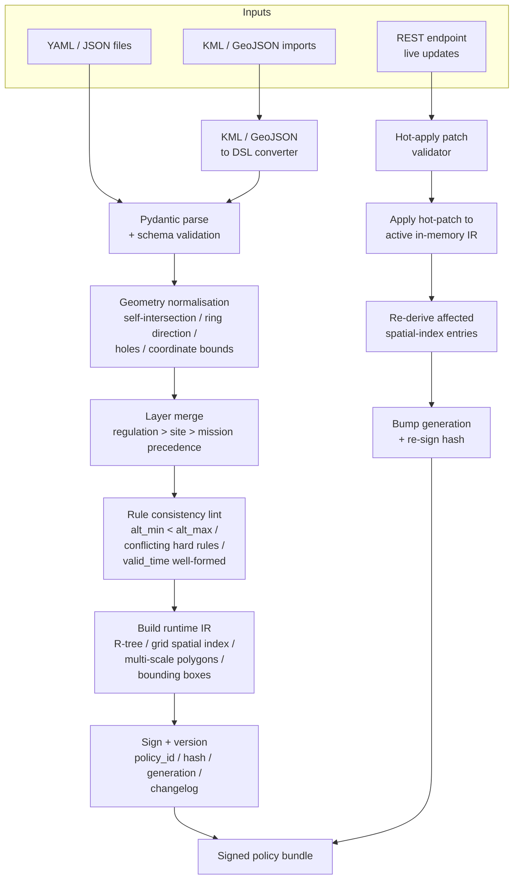

# Policy DSL

## Goal

Unify all safety / policy constraints (GeoFence, envelope, corridor, time windows, breach actions) into a single, version-controlled, validatable representation that the Prefix Compiler and Safety Shield share. Build the ingest pipeline that turns operator-authored YAML / JSON (or imported airspace data) into a signed, deployable policy bundle.

Two terms used throughout this page:

- **DSL — Domain-Specific Language.** The hand-authored surface form. YAML or JSON, with a fixed Pydantic-validated schema. This is what an operator (or an external GIS tool) writes.
- **IR — Intermediate Representation.** The parsed, validated, indexed in-memory form. A typed AST plus pre-computed spatial indices and multi-scale geometry caches. This is what the Prefix Compiler and Safety Shield consume — they never re-parse the YAML / JSON.

The DSL is operator-facing; the IR is system-facing. Together they enforce the *single source of truth* invariant: there is exactly one representation of a constraint, regardless of who reads it.

## Locked design choices

- **Implementation:** Python 3.11+ with **Pydantic v2** for both DSL parsing and IR types. Pydantic JSON Schema export is the published contract for external tooling.
- **Coordinate frame:** WGS84 latitude / longitude is canonical. Altitude is **AGL** (Above Ground Level) by default; **MSL** (Mean Sea Level) is supported as an opt-in field on geometry primitives. ENU / NED projection is computed lazily by the Prefix Compiler and Safety Shield from the WGS84 + AGL fields — the DSL itself never carries projected coordinates.
- **Mid-flight update model — hybrid.** Three constraint classes can be hot-applied mid-mission: `dynamic_nfz`, `time_window_switch`, `corridor_swap`. All other classes are locked at mission start. Every hot-apply bumps the bundle's `generation` counter and re-derives `policy_hash`.
- **External imports:** v1 ingest accepts hand-authored YAML / JSON (canonical), KML / GeoJSON file imports (for GIS-tool reuse), and a live REST endpoint for cloud-pushed updates (the channel hot-applies use).

## Layered authoring model

Operators rarely write a single monolithic policy file. The DSL supports three layers, merged with deterministic precedence at ingest time:

| Layer | Author | Update cadence | Example |
|---|---|---|---|
| **Regulation** | Authority (e.g. CAA fixed NFZs) | Once per regulatory update | Permanent airport NFZ |
| **Site** | Venue / lab manager | Per deployment | School-yard NFZ (active during class hours) |
| **Mission** | Mission operator | Per flight | "Stay inside corridor C1 for this delivery" |

Precedence (highest → lowest): mission > site > regulation. A mission-layer rule cannot relax a higher-priority hard constraint from regulation, but it can add stricter ones. The merge is performed once at ingest and cached in the IR; runtime checks look up the merged result, not the layers.

## Constraint taxonomy (Pydantic surface)

Every authored constraint is a discriminated union: a single `type` field selects the variant. The base class:

```python
from pydantic import BaseModel, Field
from typing import Annotated, Literal, Union
from datetime import time

class ConstraintBase(BaseModel):
    id: str
    constraint_type: Literal["hard", "soft"]
    scope: Literal["global", "mission", "segment", "waypoint"]
    priority: Literal["P0", "P1", "P2"]
    valid_time: "ValidTime | None" = None
    violation_action: Literal[
        "monitor_only", "project_fix", "brake", "loiter", "RTL", "land"
    ]
    layer: Literal["regulation", "site", "mission"] = "mission"
```

The taxonomy classes that subclass `ConstraintBase`:

| Class | DSL `type` | Hot-applicable? | Notes |
|---|---|---|---|
| Polygon fence | `polygon_fence` | No (locked at start) | Vertex list, AGL floor / ceiling |
| Circle fence | `circle_fence` | No | Centre + radius + AGL floor / ceiling |
| 3D corridor | `corridor` | No | Centerline polyline + width + AGL bounds |
| Altitude envelope | `altitude_envelope` | No | `alt_min` / `alt_max`, AGL or MSL |
| Kinematic envelope | `kinematic_envelope` | No | `speed_max`, `climb_rate_max`, `turn_rate_max` |
| Distance envelope | `distance_envelope` | No | Min distance to typed object class (people, buildings, roads) |
| **Dynamic NFZ** | `dynamic_nfz` | **Yes** | Polygon with motion (translate / rotate) injected mid-flight |
| **Time-window switch** | `time_window_switch` | **Yes** | Activates / deactivates a referenced rule at runtime |
| **Corridor swap** | `corridor_swap` | **Yes** | Replaces an active corridor with another at runtime |

The three hot-applicable classes are exactly those the Stress Testing scenario suite generates as dynamic events.

## Worked DSL example

```yaml
policy_id: itri-icl-2026-demo
version: 0.3.0
generation: 0
issued_at: 2026-04-28T09:00:00Z
layers_merged: [regulation, site, mission]

constraints:
  - id: nfz-school-yard
    type: polygon_fence
    constraint_type: hard
    scope: global
    priority: P0
    layer: site
    geometry:
      vertices:
        - { lat: 25.0421, lon: 121.5310 }
        - { lat: 25.0428, lon: 121.5310 }
        - { lat: 25.0428, lon: 121.5318 }
        - { lat: 25.0421, lon: 121.5318 }
      altitude_floor_m: 0
      altitude_ceiling_m: 200
      altitude_ref: AGL
    valid_time:
      recurrence:
        days: [Mon, Tue, Wed, Thu, Fri]
        start_time: "07:30"
        end_time: "17:30"
    violation_action: RTL

  - id: corridor-river-east
    type: corridor
    constraint_type: hard
    scope: mission
    priority: P0
    layer: mission
    geometry:
      centerline:
        - { lat: 25.0500, lon: 121.5400 }
        - { lat: 25.0560, lon: 121.5450 }
      width_m: 80
      altitude_floor_m: 30
      altitude_ceiling_m: 80
      altitude_ref: AGL
    violation_action: project_fix

  - id: envelope-default
    type: altitude_envelope
    constraint_type: soft
    scope: global
    priority: P1
    layer: regulation
    altitude_min_m: 5
    altitude_max_m: 120
    altitude_ref: AGL
    violation_action: brake
```

## Ingest pipeline



**Cold-start path** (top of diagram) runs once per mission start. **Hot-apply path** (bottom of diagram) runs whenever a `dynamic_nfz`, `time_window_switch`, or `corridor_swap` event arrives via the REST endpoint or the Stress Testing harness. The hot path is incremental — it does not re-parse the entire bundle, only the affected constraints.

## Versioning and signing

Every published bundle carries:

| Field | Purpose |
|---|---|
| `policy_id` | Stable identifier across versions |
| `version` | Semver string |
| `generation` | Counter that bumps on every hot-apply |
| `policy_hash` | SHA-256 over the canonicalised IR (post-merge, pre-sign) |
| `signed_by` | Lab CA or ITRI CA reference |
| `changelog` | Human-readable diff vs the previous version |

`policy_hash` is what every downstream consumer (Prefix Compiler, Safety Shield, episode bundles) records. Replaying a flight means loading the bundle whose `policy_hash` matches — never "the latest". This is the load-bearing reproducibility property.

## Acceptance KPIs (locked)

| Check | Threshold |
|---|---|
| Schema validation pass rate | 100% |
| Golden cases pass rate | 100% |
| Cold-start ingest of a typical 50-rule bundle | ≤ 1 s |
| Hot-apply latency (dynamic_nfz spawn) | ≤ 50 ms |
| Monitor query latency at 10 Hz with 50 active rules | ≤ 5 ms (10% of monitor budget) |

## Outputs

| Artefact | Form |
|---|---|
| DSL Pydantic models | Python module |
| DSL JSON Schema export | `policy_dsl.schema.json` |
| KML / GeoJSON converter | CLI |
| Ingest tool | CLI; reads files + REST endpoint, emits bundle |
| Signed policy bundle | `tar.gz` containing canonicalised IR + manifest + signature |
| REST hot-apply endpoint | FastAPI service, deployed alongside the harness |

## Open questions still to resolve

- **CA / signing authority.** Lab-internal CA or ITRI CA? Affects deployment.
- **Authoring UX.** Hand-edited YAML in an IDE for v1; web authoring tool for v2 — explicit decision needed.
- **Lint severity classes.** Errors only, or warnings vs errors? Affects how the lint report is consumed in CI.

See [R6 — Policy DSL taxonomy scope creep](../04-risks-and-fallbacks/risks.md#r6-policy-dsl-taxonomy-scope-creep) for the freeze gate at the end of Q1.
