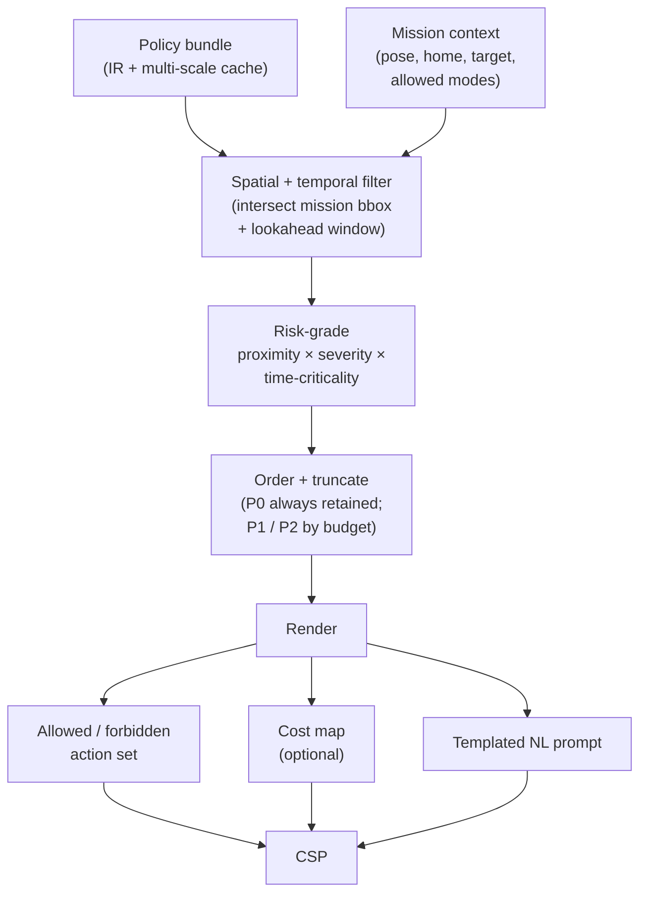

# Prefix Compiler

## Goal

Inject constraints — *summarised, compressed, and risk-graded* — into the VLA / planner input *before* candidate actions are generated, so violation-prone candidates appear less often. This reduces the load on the Safety Shield (fewer repairs to make at runtime) and lets the system spend its action budget on legitimate manoeuvres rather than reactive correction.

The Prefix Compiler is a **stateless function**: same policy bundle (`policy_hash` + `generation`) + same mission context + same rule-selection seed → same Constraint Summary Pack (CSP).

## Locked design choices

- **Implementation:** Python 3.11+ with **Pydantic v2** for the CSP schema.
- **Action space frame the CSP describes:** body frame `(vx, vy, vz, yaw_rate)`. Forbidden / allowed action sets are emitted in body frame; the Safety Shield converts to local-NED before MAVLink emit.
- **Multi-scale geometry source:** the policy bundle's IR already carries pre-computed multi-scale polygons (Policy DSL ingest produces them). The Prefix Compiler picks the scale, never re-computes.

## CSP — Constraint Summary Pack

The CSP is the Prefix Compiler's only output. It carries `policy_hash` and `generation` so any downstream consumer can be audited against the source bundle.

### Pydantic surface

```python
from pydantic import BaseModel, Field
from typing import Literal

class CSP(BaseModel):
    csp_version: Literal["1.0"]
    policy_hash: str          # sha256:...
    generation: int
    issued_at: str            # ISO 8601
    mission_id: str
    lookahead_s: float

    P0_constraints: list["P0Entry"]      # always full geometry refs
    P1_summary:     str                  # natural-language summary
    P2_summary:     str | None = None    # optional, only if budget allows

    allowed_action_set: "AllowedActionSet"
    forbidden_action_set: "ForbiddenActionSet"
    cost_map_ref: str | None = None      # for path planners; lazy-loaded artefact
    natural_language_prompt: str         # always emitted; templated, never free-form

    relevance_explanations: dict[str, str]  # rule_id -> mission-context fact
```

### Worked CSP example

```json
{
  "csp_version": "1.0",
  "policy_hash": "sha256:9d31a4...",
  "generation": 0,
  "issued_at": "2026-04-28T09:01:12Z",
  "mission_id": "demo-mission-014",
  "lookahead_s": 5.0,
  "P0_constraints": [
    {
      "id": "nfz-school-yard",
      "type": "polygon_fence",
      "geometry_ref": "coarse:nfz-school-yard@v0.3.0/g0",
      "violation_action": "RTL"
    },
    {
      "id": "corridor-river-east",
      "type": "corridor",
      "geometry_ref": "fine:corridor-river-east@v0.3.0/g0",
      "violation_action": "project_fix"
    }
  ],
  "P1_summary": "altitude limited to 5–120m AGL; cruise speed ≤ 12 m/s.",
  "allowed_action_set": {
    "vx_range_mps": [-12, 12],
    "vy_range_mps": [-12, 12],
    "vz_range_mps": [-3, 3],
    "yaw_rate_max_dps": 45,
    "altitude_band_m_agl": [30, 80]
  },
  "forbidden_action_set": {
    "no_translate_into_polygons": ["nfz-school-yard"]
  },
  "natural_language_prompt": "Never enter the school-yard polygon. Stay inside the river-east corridor between 30 m and 80 m altitude. Keep speed at or below 12 m/s.",
  "relevance_explanations": {
    "nfz-school-yard": "mission target is within 200m of polygon",
    "corridor-river-east": "mission has scope=mission and references this corridor"
  }
}
```

## Pipeline



## Risk-grading function

The risk score per rule combines three signals:

```python
def risk_score(rule, mission_ctx) -> float:
    # proximity: how close the rule's geometry is to the mission corridor
    prox = proximity_score(rule.geometry, mission_ctx.bbox)        # in [0, 1]
    # severity: hard ≫ soft, P0 > P1 > P2
    sev = severity_score(rule.constraint_type, rule.priority)      # in [0, 1]
    # time-critical: 1.0 if rule is about to activate / deactivate within lookahead
    tcrit = time_critical_score(rule.valid_time, mission_ctx.now)  # in [0, 1]
    return 0.5 * sev + 0.3 * prox + 0.2 * tcrit
```

**Truncation rule (non-negotiable):**

- All P0 hard constraints are retained, with full `geometry_ref`.
- P1 / P2 fill the remaining token / length budget by descending risk score.
- If P0-only emission already exceeds budget → **fail loudly** (raise `CSPBudgetExceeded`); do not silently truncate. See [R7](../04-risks-and-fallbacks/risks.md#r7-csp-token-budget-overflow-on-7b-vla).

## Per-consumer adapters

The same CSP is rendered into different concrete formats depending on the downstream consumer.

### Action-set adapter (default)

For any VLA backend whose action head accepts allowed / forbidden sets:

```python
{
  "vx_range_mps": [-12, 12],
  "vy_range_mps": [-12, 12],
  "vz_range_mps": [-3, 3],
  "yaw_rate_max_dps": 45,
  "altitude_band_m_agl": [30, 80],
  "no_translate_into_polygons": ["nfz-school-yard"]
}
```

### Cost-map adapter (path planners only)

Emitted as a separate artefact referenced by `cost_map_ref`:

```yaml
cost_map:
  resolution_m: 5
  origin: { lat: 25.045, lon: 121.535 }
  layers:
    - { name: nfz_hard, source: nfz-school-yard, cost: inf }
    - { name: corridor_pref, source: corridor-river-east, cost: 0 }
    - { name: corridor_outside, cost: 50 }
```

### Templated NL adapter (language-conditioned models)

Always-emitted, **templated**, never free-form. Free-form paraphrasing is the **paraphraser**'s job (Q3 deliverable, separate service); the Prefix Compiler emits the canonical templated form so the paraphraser has a clean source.

```
Never enter the school-yard polygon. Stay inside the river-east corridor between 30 m and 80 m altitude. Keep speed at or below 12 m/s.
```

## Effectiveness evaluation

Two evaluation modes ship with the Prefix Compiler:

- **Offline replay.** Apply the Prefix Compiler to a logged dataset of (policy bundle, mission context, VLA candidate action) tuples. Measure: violating-candidate rate before vs after, average repair magnitude (forwarded from Safety Shield logs), CSP token utilisation.
- **Always-on A/B during stress runs.** A scenario can be flagged for A/B; the harness runs it twice (Prefix on / off) with the same seed, and the KPI report shows the delta.

## Acceptance KPIs (locked)

- CSP token / length budget is configurable and respected.
- P0 coverage = 100% across the test fixtures.
- `CSPBudgetExceeded` raised, never silently truncated.
- Mission-context relevance is explainable: `relevance_explanations[rule_id]` is populated for every rule in the CSP.

## Outputs

| Artefact | Form |
|---|---|
| CSP Pydantic models | Python module |
| CSP JSON Schema export | `csp.schema.json` |
| Risk-grading function | Python module, configurable weights |
| Action-set adapter | Python function |
| Cost-map adapter | Python function (emits YAML) |
| NL template renderer | Jinja2 templates + Python function |
| Effectiveness eval CLI | Offline + A/B modes |

## Open questions still to resolve

- **Token budget target.** What's the exact budget after the natural-language task prompt is reserved for the chosen VLA? 1k? 2k? Determines truncation thresholds.
- **Risk-grading weights.** The 0.5 / 0.3 / 0.2 weights above are placeholders; need empirical tuning during Q2.
- **Per-VLA adapter set scope.** Does v1 ship all three adapters (action-set, cost-map, NL), or just action-set + NL? Cost-map is only useful if a path-planner backend joins the system.
