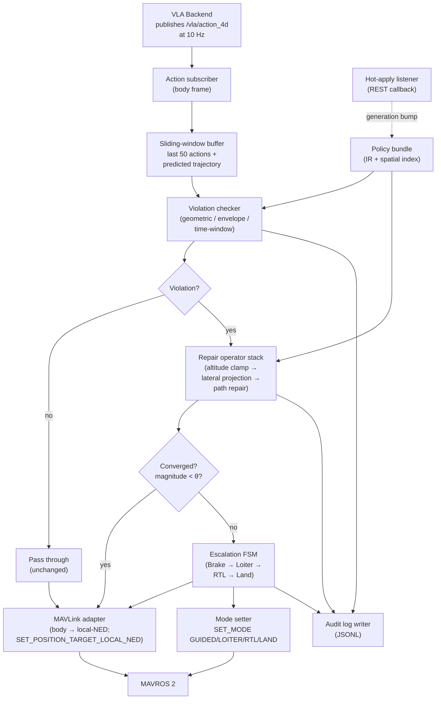
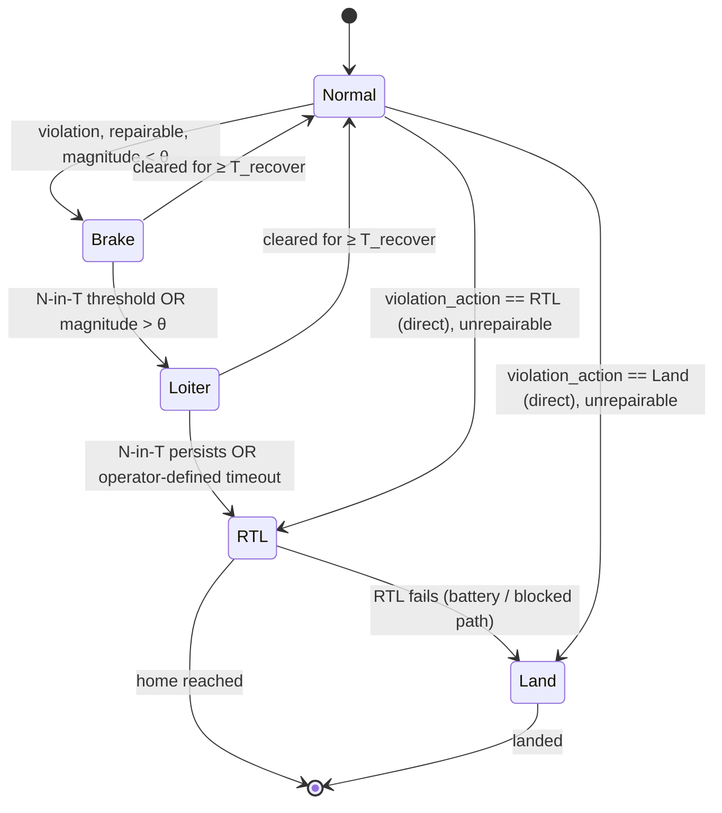

# Safety Shield

## Goal

Provide hard pre-execution and mid-execution protection: detect violations → repair via projection → trigger fail-safe (RTL / Land) when repair is unsafe; emit MAVLink to ArduPilot, coordinated with ArduPilot's built-in GeoFence and FENCE_ACTION as the ultimate backstop.

The Shield is the last software layer before the autopilot. It does not replace ArduPilot's GeoFence; it pre-empts it, so most violations are corrected without firing the autopilot's heavier-handed RTL / Land response.

## Locked design choices

- **Implementation:** Python 3.11+ as a ROS 2 node (`rclpy`). Pydantic v2 for the audit-log records.
- **Action input frame:** body frame `(vx, vy, vz, yaw_rate)`. This is the contract with the VLA. The body→local-NED conversion happens in the MAVLink adapter, *after* projection — keeps repair operators acting on the same frame the VLA emits in.
- **Monitor rate:** 10 Hz, matching the VLA action rate.
- **Lookahead horizon:** 5 s of predicted trajectory at 10 Hz = 50 future poses.
- **Position:** between the VLA's action publisher and MAVROS 2. Planner-output → before ArduPilot.

## Node architecture



## Violation checking

The checker reuses the [Policy DSL](policy-dsl.md) IR — there is exactly one rule-evaluation code path in the system. It runs three categories at every monitor tick:

| Category | Check |
|---|---|
| **Geometric** | Position point ∈ NFZ? Predicted trajectory segment crosses polygon / corridor boundary? |
| **Envelope** | Altitude / speed / distance violate envelope bounds? |
| **Time-window** | Rule diff at a window switch — handle the "boundary instant" by checking both sides at `t-ε` and `t+ε`. |

The lookahead horizon is 5 s; geometry queries hit the IR's R-tree spatial index. With ~50 active rules and 50 future-pose checks per tick, total query budget is ≤ 5 ms (10% of the 100 ms monitor budget).

## Repair operators

Tried in priority order. First operator that produces a feasible action with magnitude ≤ threshold wins.

```python
class RepairOperator(Protocol):
    name: str
    def repair(
        self, action: Action4D, violation: Violation, ir: PolicyIR
    ) -> RepairAttempt: ...

# Priority 1
class AltitudeClamp(RepairOperator):
    """Clamp vz so the predicted z stays in [alt_min, alt_max].
    Cheap; resolves most envelope-only violations."""

# Priority 2
class LateralProjection(RepairOperator):
    """Project the predicted point to the nearest feasible point
    outside the NFZ or inside the corridor. Body-frame projection
    via the precomputed signed distance field per polygon."""

# Priority 3
class PathRepair(RepairOperator):
    """If a predicted segment crosses a boundary, insert a detour
    waypoint in body frame. Simplified path repair — full path
    planning is out of scope for the Shield."""
```

**Conservative cap.** If `||action_repaired - action_original||` > threshold, or no operator converges, the Shield abandons projection and triggers fail-safe.

**Iteration bound.** A bounded loop (default 3 iterations) guards against repair operators that interact destructively under simultaneous violations. See [R8](../04-risks-and-fallbacks/risks.md#r8-repair-operator-non-convergence-under-simultaneous-violations).

## Escalation FSM



**Defaults:** N=3, T=5s, θ=2.0 m (lateral) / 0.5 m (vertical), T_recover=2s. All five are config-file overridable per mission profile.

## MAVLink adapter

| Mission style | Message | Notes |
|---|---|---|
| Live setpoint flight (GUIDED) | `SET_POSITION_TARGET_LOCAL_NED` | Default for VLA-driven flight. Body→NED conversion using current attitude. |
| Pre-planned waypoint mission | `MISSION_ITEM_INT` | For mission-style flight; replaces or updates the next waypoint. |
| Mode escalation | `SET_MODE` → GUIDED / LOITER / RTL / LAND | Drives the FSM transitions above. |

**Body-frame → local-NED conversion** lives here, applied to every emitted setpoint. Repair operators above never see local-NED; the conversion is a single boundary in the codebase.

**AP GeoFence coordination.** GCS-set AP GeoFence parameters (`FENCE_ENABLE`, `FENCE_TYPE`, `FENCE_ACTION`) remain configured as a **last-line backstop**. They fire only if the Shield itself crashes or fails to emit. The Shield handles finer-grained constraints (corridor, time-window, distance envelope) that AP's GeoFence cannot express.

## Audit log

Every monitor tick that produces a violation event writes a JSONL record:

```json
{
  "ts": "2026-04-28T09:01:12.345Z",
  "policy_hash": "sha256:9d31...",
  "generation": 0,
  "monitor_tick": 12345,
  "raw_action": {"vx": 5.0, "vy": 1.2, "vz": 0.0, "yaw_rate": 0.1},
  "violations": [
    {"rule_id": "nfz-school-yard", "category": "geometric",
     "boundary_intersect_at_s": 1.4}
  ],
  "repair_attempts": [
    {"operator": "AltitudeClamp", "result": "skip", "reason": "no altitude violation"},
    {"operator": "LateralProjection", "result": "ok",
     "magnitude_m": 0.7, "iterations": 1}
  ],
  "emitted_action": {"vx": 4.7, "vy": -0.3, "vz": 0.0, "yaw_rate": 0.1},
  "fsm_state_before": "Normal",
  "fsm_state_after":  "Brake"
}
```

Records ship as JSONL during a flight and are aggregated into the [episode bundle](stress-testing.md) by the Stress Testing harness at episode end.

## Test matrix

Every release runs this matrix in Stress Testing's smoke set:

| Stressor | What it exercises |
|---|---|
| **High-speed near-edge** | Lateral projection accuracy under tight margin |
| **Sudden NFZ** (hot-applied dynamic_nfz) | Reaction time when the IR generation bumps mid-flight |
| **Time-window switch instant** | Boundary-instant handling in violation checking |
| **Three simultaneous violations** | Repair operator interaction; bounded iteration |
| **GPS noise / latency** | Stability under sensor degradation |

## Acceptance KPIs (locked)

| KPI | Target |
|---|---|
| Violation escape rate (P0) | **0** (hard limit; report cannot ship if non-zero on P0) |
| Repair success rate | tracked; informs Prefix Compiler effectiveness eval |
| Mean time to safe | tracked; from violation to back-in-safe-zone |
| Monitor tick budget | ≤ 100 ms (10 Hz) end-to-end |

## Outputs

| Artefact | Form |
|---|---|
| Safety Shield ROS 2 node | Python package; `rclpy` |
| Violation checker library | Python module; shares IR with Policy DSL |
| Repair operator library | Python module; pluggable Protocol |
| Escalation FSM | Python state machine; YAML-overridable thresholds |
| MAVLink adapter | ROS 2 node bridging Shield → MAVROS 2 |
| Audit-log JSONL writer | Python module; rotated per mission |

## Open questions still to resolve

- **ROS 2 distribution.** Humble (LTS, AI Wings parity), Iron, or Jazzy?
- **Repair operator iteration count.** Default 3 — empirically tune in Q2.
- **N-in-T defaults.** Starting at 3-in-5s; adjust against stress-run data.
- **Audit log retention.** How many missions of JSONL retained on the Orin? Affects flash budget.
