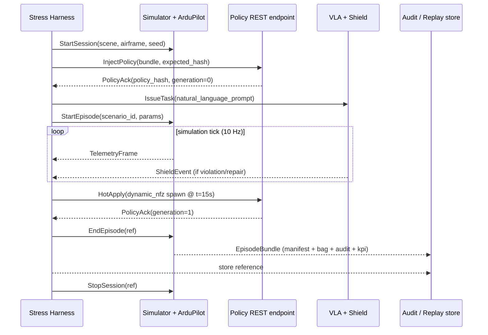

# Stress Testing

## Goal

In simulation, manufacture *dynamic constraints* and *high-stress scenarios* to drive regression testing, data collection, and (optionally) VLA / policy-model training. The Stress Testing harness is the only way the project produces the contractual KPI numbers — every reported KPI in the final report comes from a Stress Testing run executed in the canonical HIL topology.

This page covers **what gets built** for stress testing. **Where it runs** (Gazebo Harmonic for functional sweeps, Project AirSim for perception stress) is documented in the [Simulation framework](../03-simulation/dual-rail.md) section.

## Locked design choices

- **Implementation:** Python 3.11+ throughout (harness, scenario authoring, exporters). Pydantic v2 for the `ScenarioSpec` schema.
- **Control plane:** gRPC over mTLS. Same root CA as SROS 2 for cert reuse.
- **Mid-flight events:** the harness drives `dynamic_nfz`, `time_window_switch`, and `corridor_swap` events via the Policy DSL's REST hot-apply endpoint. These are the only mid-flight constraint changes supported.
- **Determinism:** every episode emits a six-field manifest (`code_revision`, `vla_model_hash`, `policy_hash`, `random_seed`, `sim_speedup`, `topology`); `sim_speedup=1.0` is mandatory for any KPI-bearing run in the HIL topology.

## Scenario authoring

Scenarios are declarative YAML, validated through Pydantic at load time. Pure-data form keeps them diffable; programmability is layered on through parameter sweeps.

### Pydantic surface

```python
from pydantic import BaseModel
from typing import Literal

class ScenarioSpec(BaseModel):
    scenario_id: str
    template: Literal[
        "dynamic_nfz_movement",
        "time_window_switch",
        "radius_scaling",
        "corridor_swap",
    ]
    description: str
    mission: "Mission"
    policy: "PolicyRef"
    events: list["ScenarioEvent"]
    parameter_sweep: dict[str, list]  # field name -> sweep values
    expected_kpis: "ExpectedKPIs"

class ScenarioEvent(BaseModel):
    at_sim_t: float
    type: Literal[
        "spawn_polygon_fence",
        "translate_polygon_fence",
        "rotate_polygon_fence",
        "activate_rule",
        "deactivate_rule",
        "swap_corridor",
        "scale_radius",
    ]
    payload: dict  # event-specific
```

### Worked ScenarioSpec example

```yaml
scenario_id: dyn-nfz-translate-001
template: dynamic_nfz_movement
description: "Polygon NFZ spawns 60 m ahead at t=15s, translates 5 m/s perpendicular to flight path."

mission:
  task_prompt: "Fly to waypoint W3 along corridor C1 at cruise altitude."
  start_pose: { lat: 25.0421, lon: 121.5310, alt_agl_m: 50, yaw_deg: 90 }
  target:    { lat: 25.0560, lon: 121.5450, alt_agl_m: 50 }

policy:
  bundle_path: ./bundles/itri-icl-2026-demo-v0.3.0.tar.gz
  expected_hash: sha256:9d31...

events:
  - at_sim_t: 15.0
    type: spawn_polygon_fence
    payload:
      width_m: 40
      height_m: 60
      ahead_of_vehicle_m: 60
  - at_sim_t: 15.0
    type: translate_polygon_fence
    payload:
      mps: 5.0
      direction: perpendicular_left

parameter_sweep:
  vehicle_speed_mps: [6, 8, 10, 12]
  wind_speed_mps:    [0, 2, 5]
  random_seed:       [1001, 1002, 1003]

expected_kpis:
  P0_escape_rate:        0
  fail_safe_correctness: ">=0.99"
  mean_time_to_safe_s:   "<=2.0"
```

A single `ScenarioSpec` with the sweep above expands to 4 × 3 × 3 = 36 episode runs.

## RPC harness

The control plane is gRPC; the data plane is the simulator's existing ROS 2 / MAVLink path.

### Service surface (proto-ish)

```protobuf
service StressHarness {
  // Session lifecycle
  rpc StartSession  (StartSessionRequest)  returns (SessionRef);
  rpc StopSession   (SessionRef)           returns (StopResponse);

  // Policy
  rpc InjectPolicy  (InjectPolicyRequest)  returns (PolicyAck);
  rpc HotApply      (HotApplyRequest)      returns (PolicyAck);   // dynamic_nfz / time_window_switch / corridor_swap

  // Episode
  rpc StartEpisode  (StartEpisodeRequest)  returns (EpisodeRef);
  rpc IssueTask     (IssueTaskRequest)     returns (TaskAck);
  rpc EmitEvent     (EmitEventRequest)     returns (EventAck);    // ScenarioEvent
  rpc EndEpisode    (EpisodeRef)           returns (EpisodeBundle);

  // Streams
  rpc StreamTelemetry (SessionRef) returns (stream TelemetryFrame);
  rpc StreamEvents    (SessionRef) returns (stream HarnessEvent);
}
```

### Session lifecycle



### Test scheduling

| Profile | Cadence | Scope | sim_speedup |
|---|---|---|---|
| **Smoke** | per build (CI) | ~50 scenarios × 1 seed each | 1.0 (KPI-grade) |
| **Nightly KPI** | nightly | ~200 scenarios × 3 seeds | 1.0 (KPI-grade, HIL topology) |
| **Broad sweep** | nightly | ~3000 scenarios × 5 seeds | > 1.0 (functional rail only) |

The smoke and nightly KPI runs are reproducible at `sim_speedup=1.0` and feed the final KPI report. The broad sweep runs at speed > 1 for coverage; its results are tracked but not part of the final KPI numbers.

## Episode bundle

Every episode produces a self-contained bundle that can be replayed bit-for-bit:

```
episode-2026-08-15T14-22-08Z--dyn-nfz-translate-001--seed1001/
├── manifest.json          # 6-field determinism manifest
├── policy_bundle.tar.gz   # the exact bundle that was active (incl. all hot-apply generations)
├── episode.bag2/          # rosbag2 capture: sensors, actions, MAVLink, mode changes
├── shield_audit.jsonl     # Safety Shield audit log
├── harness_events.jsonl   # ScenarioEvents emitted, telemetry markers
└── kpi.json               # computed KPIs for this episode
```

## Data record schema

For analysis / training, every step is recorded:

| Field | Source |
|---|---|
| `observation` | rosbag2 image + state topics |
| `policy_state` | active rules at this tick (carries `policy_hash` + `generation`) |
| `action.planner_output` | VLA's raw 4-D output |
| `action.post_repair` | Shield's emitted action (post-projection) |
| `action.executed` | what MAVROS actually published |
| `outcome` | `success` \| `fail` \| `RTL_triggered` \| `Land_triggered` |

**Auto-labels.** Derived from the Shield's audit log:

- `violation_type` ∈ `{fence, alt, schedule, envelope, distance, ...}`
- `risk_level` ∈ `{P0, P1, P2}` (copied from the rule that triggered)

**Two export formats** — episode-based (one row per mission, full trajectory) and step-based (one row per tick) — produced by exporters that consume the same episode bundle. Both ship in v1; both are needed (RL / behaviour cloning prefers episode-based; monitoring analytics prefers step-based).

## KPI report

The auto-report has two sections:

1. **Per-scenario-family stats table.** One row per (scenario template, parameter cell) tuple. Columns: episode count, P0 escape rate, fail-safe correctness, mission success rate, mean repair count, mean repair magnitude.
2. **Top-K failure cases.** K=10 by default. Each row links to its episode bundle for offline replay; columns: scenario_id, parameters, failure category, raw vs repaired action.

Output formats: Markdown (for inclusion in the final report) and JSON (machine-readable, for trend tracking across nightly runs).

## Acceptance KPIs (locked)

| KPI | Target | Source |
|---|---|---|
| Mission success rate | tracked, no hard target | `outcome == success` AND `no_P0_violation` |
| P0 violation escape rate | **0** (hard limit) | Counter from Shield repair log |
| Fail-safe trigger correctness | ≥ 99% | Triggered when expected, not when not expected |
| Average repair count / episode | tracked | Counter from Shield repair log |
| Average repair magnitude | tracked | Mean of `||post_repair − planner_output||` |

## Outputs

| Artefact | Form |
|---|---|
| ScenarioSpec Pydantic models | Python module |
| Scenario library | YAML files (one per template) |
| Sweep config files | YAML, per nightly profile |
| RPC harness | Python service + gRPC stubs |
| Episode exporters | Python CLI (rosbag2 → JSONL / Parquet) |
| KPI auto-report generator | Python CLI (Markdown + JSON) |
| CI smoke pipeline | GitHub Actions or similar |

## Open questions still to resolve

- **Scheduler.** `asyncio` worker pool vs Ray vs external. Affects the parallelism story for the broad sweep.
- **Episode bundle storage.** Local FS only, or also S3-style for nightly aggregation?
- **CI host.** Lab CI infra or hosted runners? Affects smoke set throughput.
- **Failure-case top-K** — K=10 default; does the PI want it configurable per report?

See [R9 — RPC harness throughput vs nightly-window budget](../04-risks-and-fallbacks/risks.md#r9-rpc-harness-throughput-vs-nightly-window-budget) for the smoke + broad-sweep split rationale.
