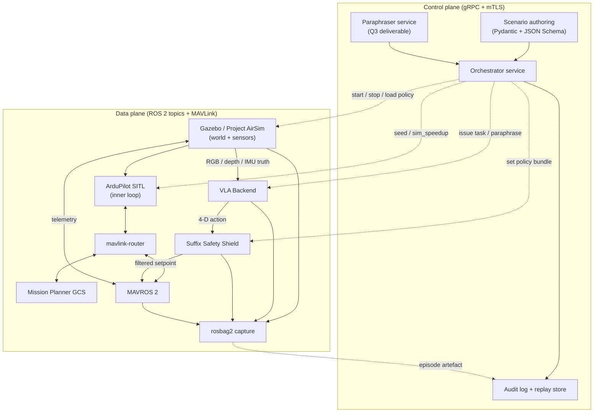

# Data flow

The system splits cleanly into a **control plane** (orchestrator, scenario lifecycle, audit) and a **data plane** (sensors → VLA → Shield → autopilot, plus telemetry back-channel). Keeping these separate is the reason stress testing can issue thousands of scenarios without touching the autopilot's real-time path.

## End-to-end data + control plane



## Control plane

**Transport.** gRPC over mTLS. Per-component certificates from `cfssl` or `step-ca` with a shared root CA; SROS 2 turned on for the ROS 2 graph using the same root CA.

**Responsibilities.**

- Start / stop simulator sessions.
- Load policy bundles into the Shield.
- Issue tasks (and paraphrased variants) to the VLA.
- Capture episode artefacts to the audit / replay store.
- Stream telemetry, events, and intercepts to whatever client is observing the run.

**Why gRPC, not ROS 2 services.** ROS 2 services are first-class for in-graph robot tooling, but the orchestrator must also speak to non-ROS clients (CI, dashboards, scenario authoring tools). gRPC + protobuf makes the schema explicit and language-agnostic.

## Data plane

**Transport.** ROS 2 topics inside a single DDS domain; MAVLink (over UDP via `mavlink-router`) on the autopilot side.

**Topics that matter.**

| Topic | Producer | Consumer | Rate |
|---|---|---|---|
| `/sensor/rgb/image` | Simulator | VLA | ≥10 Hz |
| `/sensor/depth/image` | Simulator | VLA (optional) | ≥10 Hz |
| `/vla/action_4d` | VLA | Shield | 10 Hz |
| `/shield/setpoint` | Shield | MAVROS 2 | 10 Hz |
| `/mavros/state` | MAVROS 2 | Shield | event |
| `/mavros/local_position/pose` | MAVROS 2 | Shield + VLA | 30 Hz |
| `/shield/intercept` | Shield | Audit | event |

## Determinism contract

Every recorded episode is reproducible bit-for-bit from six fields:

```yaml
code_revision:  <git SHA across the entire stack>
vla_model_hash: <SHA-256 of model weights>
policy_hash:    <hash of policy bundle>
random_seed:    <integer, applied uniformly>
sim_speedup:    1.0    # mandatory for hil
topology:       hil    # dev | hil | flight
```

These fields are emitted by the orchestrator at episode start and stored as the first frame of every rosbag. A run that cannot produce these six values is rejected from the KPI report.

## Replay path

A finished episode produces an artefact bundle:

```
episode-2026-08-15T14-22-08Z/
├── manifest.json          # the six determinism fields
├── policy_bundle.tar.gz   # signed policy bundle
├── episode.bag2/          # rosbag2 capture
├── audit.jsonl            # control-plane events
└── kpi.json               # computed KPIs
```

Replaying an artefact reproduces the trajectory exactly — that is what makes failure analysis tractable when a scenario produces an unexpected P0 violation in CI.
