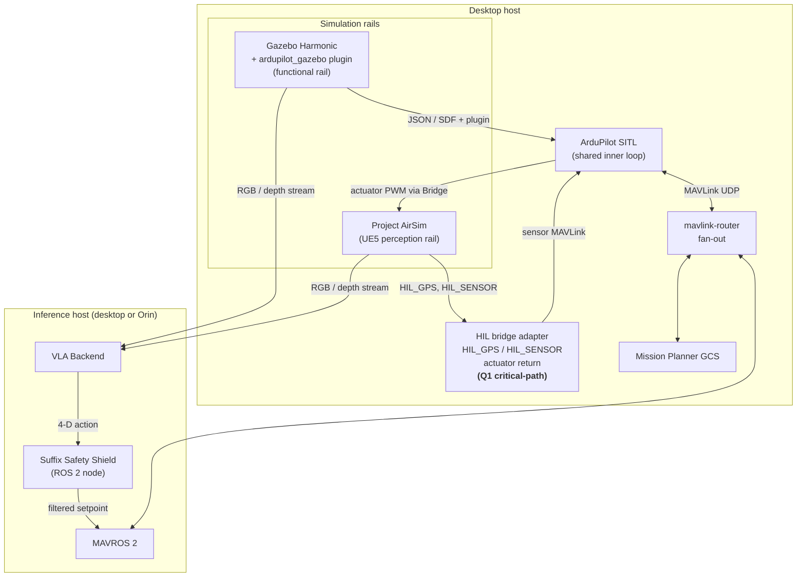

# Dual-rail decision

> **Locked 2026-04-27.** The simulation framework is **Gazebo Harmonic** (functional rail) plus **Project AirSim** (perception rail), both connected to one shared **ArduPilot SITL**. MAVROS 2 carries the safety path; Mission Planner attaches via `mavlink-router` fan-out.

## Why two rails

The scoring in the [Comparison matrix](comparison-matrix.md) shows no single L2 candidate wins all six axes. The two-rail split routes each component to the rail that scores best for it:

| Used for | Rail | Reason |
|---|---|---|
| Policy DSL GeoFence regression | Functional | Headless, fast, scriptable; no perception needed |
| Prefix Compiler CSP sweep | Functional | Pure planner-side test; no images |
| Safety Shield unit/integration tests | Functional | Determinism > photo-fidelity for KPI repeatability |
| Safety Shield projection on real-VLA action streams | Perception | Need real photoreal observations to drive the VLA realistically |
| Dynamic stress (functional regression) | Functional | Sweep many seeds cheaply |
| Dynamic stress (perception robustness) | Perception | Texture / lighting / shadow stressors |
| Demos (mid-term, final) | Perception (+ VIVID overlay for VR demos) | Visually compelling |

The functional rail bears every contractual KPI. The perception rail provides additional robustness data and visual demos. If the perception rail slips (see [Fallback gates](../04-risks-and-fallbacks/fallback-gates.md)), the grant still ships.

## Architecture

## Rail responsibilities

**Functional rail — Gazebo Harmonic + `ardupilot_gazebo`**

- Owns CI. Every PR runs the Safety Shield regression suite here, headless, in minutes.
- Owns determinism contract for KPI runs. `sim_speedup=1` honoured; locked seeds; rosbag2 capture.
- Drives Policy DSL / Prefix Compiler / Safety Shield acceptance tests. Final report numbers come from this rail.
- Plugin: [`ArduPilot/ardupilot_gazebo`](https://github.com/ArduPilot/ardupilot_gazebo).

**Perception rail — Project AirSim**

- Owns photoreal stress. Perception-robustness scenarios (lighting, weather, novel textures, dynamic actors with realistic appearance) live here.
- Drives demos. Mid-term and final demo videos are recorded from this rail.
- **Requires the Q1 HIL bridge adapter.** AirSim's native vehicle controllers do not include ArduPilot, so the perception rail talks to AP SITL via `HIL_GPS` / `HIL_SENSOR` ingest plus actuator-PWM return.

**Shared inner loop — one ArduPilot SITL**

Both rails point at one SITL instance. The SITL is the single source of truth for autopilot behaviour — flight-mode state, fence breaches, RTL, Land are all driven by the *one* AP firmware code path. Switching rails switches sensor source, never autopilot identity.

## Why not three rails

Adding Isaac Sim + Pegasus as a third rail (or as a swap for Project AirSim) is technically defensible and is flagged in [Risks](../04-risks-and-fallbacks/risks.md) as the largest counterfactual. The case for keeping the lock at two rails:

- Three rails triple integration / bridge / docker maintenance cost.
- Pegasus's ArduPilot path is younger than Khancyr's.
- The Orin alignment argument doesn't change KPI numbers — those are measured in HIL topology, where Project AirSim's desktop-only constraint is already accommodated.

The case for re-opening: NVIDIA-vertical alignment, USD scene ecosystem, and Isaac Lab's domain-randomization tooling are real assets for perception stress. A one-day spike before Q2 is recommended.

## What changes if the perception rail is dropped or swapped

| Scenario | Effect on grant |
|---|---|
| Perception rail intact (Project AirSim, HIL bridge closed-loop) | All deliverables on plan |
| Swap to Colosseum at 2026-06-30 gate | Q3 perception scenarios slightly delayed; final demos slightly less polished. KPIs unaffected. |
| Both photoreal rails fail | Functional rail still ships all KPIs. Perception-robustness scope narrows; document waiver in final report. |
