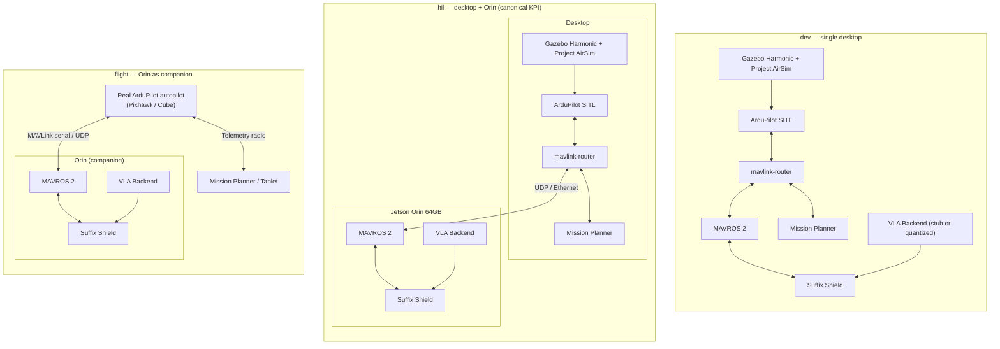

# Deployment topologies

Three first-class topologies. The same code base must run cleanly in all three — none is a degraded mode.

| Topology | Purpose | KPI bearing? |
|---|---|---|
| **dev** | Fast iteration, CI, unit/integration testing | No — debug/development only |
| **hil** | Canonical KPI configuration | **Yes — all reported numbers come from here** |
| **flight** | Closest to AI Wings real-flight; demos | No — qualitative validation |

## Three-topology layout



## Per-topology details

### dev — single desktop

- Everything on one box. Simulators, autopilot, ROS 2 graph, VLA stub all colocated.
- VLA may be a deterministic stub for unit tests, or a quantized model if the desktop has a GPU.
- Used for iterating, debugging, CI. **Not used for reported KPI numbers.**
- Project AirSim still runs locally (Unreal Engine 5 needs a discrete GPU on the desktop).

### hil — desktop + Orin (canonical KPI)

- **This is the configuration every reported KPI is measured against.**
- Desktop runs the simulators (Gazebo Harmonic + Project AirSim), ArduPilot SITL, `mavlink-router`, and Mission Planner.
- Orin runs MAVROS 2, the Suffix Shield ROS 2 node, and the full VLA backend.
- The desktop ↔ Orin link is wired Ethernet, low-latency, low-jitter. Cyclone DDS partitions traffic across the boundary.
- `sim_speedup=1.0` is **mandatory** here — wall-clock fidelity is what makes the KPI numbers meaningful.

### flight — Orin as companion

- Orin attaches as a companion computer to a real ArduPilot autopilot (Pixhawk or Cube class) on AI Wings hardware.
- No simulator. The world is the world.
- Same MAVROS 2 + Shield + VLA stack as hil — by design, the Orin software image is identical between hil and flight, so promoting from hil to flight is a configuration change, not a code change.
- Mission Planner attaches via telemetry radio.

## Why Project AirSim is always on the desktop

Unreal Engine 5 needs a discrete NVIDIA GPU. The Orin's integrated GPU is excellent at neural inference but it is not a UE5 host. Project AirSim therefore lives on the desktop in **all three topologies** that involve simulation (dev, hil). In flight there is no simulator at all.

## Topology promotion path

```
dev  →  hil  →  flight
```

The identical Docker image runs in all three. Topology selection is a config flag, not a rebuild. This is a hard requirement — it's how the lab ensures KPI numbers measured in hil transfer to flight without surprise.
