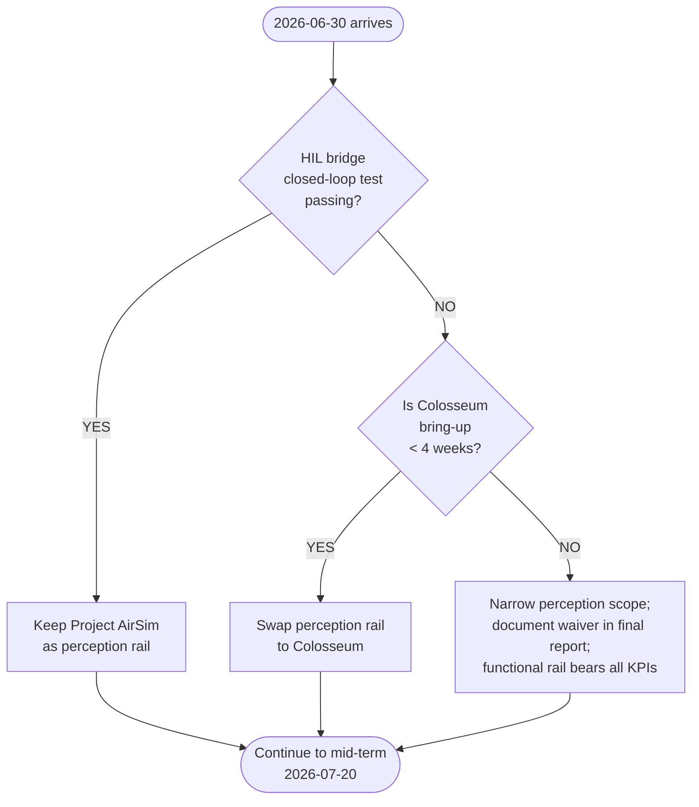

# Fallback gates

A **fallback gate** is a written decision rule with a date attached. When the date arrives, the project applies the rule mechanically — no further debate, no hand-wringing about sunk cost. This page documents the one gate currently in effect and the rules around future gates.

## Gate G1 — Project AirSim HIL bridge closed-loop check

> **Date:** 2026-06-30 · **Owner:** PI

### Decision rule

```
IF  the Project AirSim ↔ ArduPilot HIL bridge passes a closed-loop integration test by 2026-06-30
THEN keep the perception rail on Project AirSim
ELSE swap the perception rail to Colosseum, freeze Project AirSim work, document the swap in the final report
```

### What "closed-loop integration test" means

All four conditions must hold:

1. AirSim sensor messages (`HIL_GPS`, `HIL_SENSOR`) reach AP SITL and AP's EKF converges on the AirSim-reported position to within 1 m.
2. AP SITL's actuator PWM output drives AirSim's vehicle model to produce visible motion in the AirSim viewport.
3. A scripted square-pattern mission flies in AirSim with AP in `AUTO` mode, completes without breach, and lands within 2 m of takeoff.
4. The same mission is repeatable across three runs with the same `random_seed`.

If any of these four fail by 2026-06-30, the gate fires.

### Why Colosseum is the fallback

| Property | Project AirSim | Colosseum |
|---|---|---|
| Photo-fidelity | UE5 ✓✓ | UE5 ✓✓ |
| ArduPilot integration | HIL bridge required | **Native upstream** |
| License | Microsoft commercial | MIT |
| Bring-up cost | Q1 critical path | Days, not weeks |

Colosseum has the same lineage as the original Microsoft AirSim that the lab is already familiar with. The team has more institutional knowledge of that codebase than of Project AirSim's TypeScript core.

## Decision flow



## Gates not yet active

These are documented here so the team has them on the radar but no date has been set:

### Gate G2 candidate — Pegasus + Isaac Sim spike outcome

If the Q1 spike (see [R4](risks.md#r4-pegasus-isaac-sim-is-the-road-not-taken)) shows Pegasus's bring-up cost as comparable to or lower than the Project AirSim HIL bridge, a gate could be added: *"if Pegasus reaches closed-loop test before Project AirSim's HIL bridge, swap perception rail to Pegasus."* Adding this gate is a PI decision, not a default.

### Gate G3 candidate — Orin VLA inference latency

If the chosen 7B-class VLA backend cannot produce 4-D actions at 10 Hz on the Orin in `int8` quantization, a gate could be added: *"if Orin inference latency > 100 ms p95 by 2026-08-01, swap to a smaller / quantized backend (e.g. BitVLA, TinyVLA)."* Whether to add this gate depends on Q2 measurement.

## Why mechanical gates beat ad-hoc decisions

The temptation to keep pushing on Project AirSim's HIL bridge "just one more week" is exactly how mid-term deliveries slip. A written gate with a date converts a judgment call into a reflex. The decision was made when the gate was written, not when the date arrives — that is the entire point of writing it down.
