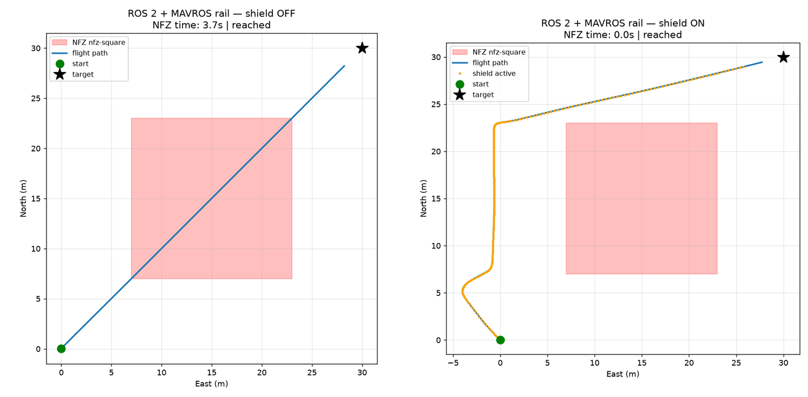
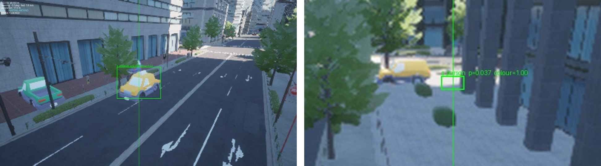

# Guardrail — Mid-Evaluation Progress Report

**Semantic-Spatial Translation and Safety-Constrained VLA for ArduPilot UAVs** · ITRI · National Taipei University of Technology · September 2026 · software version 0.5.1

Advisor: · Author: · Numbers generated 2026-09-14 by `tools/build_eval_data.py`

---

## 1. Summary

- **The contractual gate is cleared.** The grant's canonical topology — ArduPilot SITL driven over MAVROS 2 on ROS 2 Jazzy — produces KPI-grade runs, 5 of them.
- **All five acceptance KPIs are measured**, not inferred: mission success, P0 violation escape rate, fail-safe trigger correctness, mean repair magnitude and mean time to safe.
- **P0 violation escape rate is 0.0 on all 41 shielded flights.** The 5 deliberately unshielded control flights read 0.63, which is what they exist to show.
- **Perception is the open half.** Tracking runs on Project AirSim, a functional rail outside the contractual gate; the pedestrian detector does not beat a centre-constant null; and no rule protects pedestrians other than the one being followed.
- **15 changes since the 2 September meeting**, including four silent defects found and fixed, a steadier tracker, and two published claims corrected (Section 8).

## 2. Scope and acceptance criteria

| Work package | Deliverable | Status | Evidence |
|---|---|---|---|
| WP1 | Policy DSL and intermediate representation | Built | Six constraint types, `valid_time` on every rule, signed policy bundle |
| WP2 | Prefix constraint compiler | Built | Constraint summary pack rendered into the model prompt |
| WP3 | Suffix Safety Shield | KPI-grade | 5 canonical-HIL runs |
| WP4 | Stress testing and evidence | Built | 13-scenario sweep, replay bundles, per-flight manifests |

The five KPIs are named in the grant. They are computed by one function, `guardrail.kpi.compute`, used identically by the flights, the scenario sweep and the replay verifier.

| KPI | Meaning | Target |
|---|---|---|
| Mission success | The mission reached its goal | — |
| P0 violation escape rate | Detected P0 violations that reached the actuator | 0 |
| Fail-safe trigger correctness | The fail-safe fired when, and only when, it should | 1.0 |
| Mean repair magnitude | Average size of a Shield correction, m/s | — |
| Mean time to safe | Time from an unsafe state back to a safe one, s | — |

## 3. System architecture

A camera frame and an operator's phrase enter an open-vocabulary detector (OWL-ViT). An instance lock keeps the controller on one object; a target-state estimator turns bearing and range into a velocity command. That command — the **Action4D**, `(vx north, vy east, vz up, yaw_rate)` at 10 Hz with `yaw_rate` in rad/s — is the Shield's only input. The Shield checks it against the policy, repairs or brakes, writes an audit record, and passes the result to MAVROS 2 and ArduPilot.

The action source is deliberately swappable. OpenVLA-7B, AerialVLA, a behaviour-cloned policy and the hand-written controller have all flown through the same slot. The safety argument does not depend on which model is driving.

| Rail | Flights | Camera | KPI-grade |
|---|---|---|---|
| Project AirSim (Unreal) | 34 | Yes | No |
| ArduPilot SITL · pymavlink | 7 | No | No |
| ArduPilot SITL · MAVROS 2 · ROS 2 Jazzy | 5 | No | **Yes** |

## 4. Progress by work package

### WP1 — Policy DSL

| Constraint | What it enforces |
|---|---|
| `PolygonFence` | Keep-out zone, optional altitude band |
| `AltitudeEnvelope` | Floor and ceiling above ground |
| `KinematicEnvelope` | Horizontal speed, climb rate and yaw-rate caps |
| `ObstacleClearance` | Minimum distance from every mapped building |
| `SubjectStandoff` | Minimum distance from the followed subject, selected by class |
| `Corridor` | Keep-in route with width and altitude band |

Every rule may carry `valid_time`. The policy hash is written into every audit record, and a signed bundle refuses a tampered IR, a foreign manifest or a truncation on reload.

### WP2 — Prefix constraint compiler

Operator text is compiled into a structured mission and a constraint summary pack. The prompt is rendered from the pack, so the rules the model is told and the rules the Shield enforces come from the same object.

### WP3 — Suffix Safety Shield

Each tick the Shield predicts the next 3 s, checks every rule, applies the smallest legal repair, re-checks the repaired action, and falls back to a recovery heading or a brake. On the canonical rail its fail-safe trigger correctness is 1.0 and its mean repair magnitude 4.07 m/s (maximum 7.21 m/s).

### WP4 — Stress testing and evidence

The headless scenario sweep scores every scenario with `guardrail.kpi.compute`: **12 pass, 0 fail, 1 known failure.**

| Scenario | Status | P0 escape rate |
|---|---|---|
| `nfz-head-on` | pass | 0.0 |
| `nfz-head-on-control` | pass | 0.173333 |
| `altitude-floor-recovery` | pass | 0.0 |
| `altitude-ceiling-hold` | pass | 0.0 |
| `speed-cap` | pass | 0.0 |
| `nonfinite-action` | pass | 0.0 |
| `corridor-along` | pass | 0.0 |
| `corridor-drift-out` | pass | 0.0 |
| `corridor-curfew-in-hours` | pass | 0.0 |
| `corridor-curfew-out-of-hours` | pass | 0.0 |
| `standoff-approach` | pass | 0.0 |
| `standoff-reclassified` | pass | 0.0 |
| `standoff-wedge` | known_failure | 0.0 |

`nfz-head-on-control` is an unshielded control and passes by failing its safety gate. `standoff-wedge` is the one open defect, pinned as a scenario: a subject exactly on the route makes every forward direction close the range, so the Shield never emits an illegal action but the mission cannot get past.

Every flight writes a manifest (code revision, detector weights hash, policy hash, seed, simulator speed-up, topology). A replay bundle re-derives the flight's KPIs from its own log. Tests: **460/460 fast** and **17/17 coverage**, both run on 2026-09-14.

## 5. KPI results — canonical HIL

| KPI | No-fly zone | Dynamic no-fly zone | Pedestrian stand-off | Unshielded control |
|---|---|---|---|---|
| P0 escape rate | **0.0** | **0.0** | **0.0** | 0.63 |
| Fail-safe correctness | 1.0 | 1.0 | 1.0 | 0.0 |
| Mission success | Yes | Yes | Yes | No |
| Mean repair magnitude (m/s) | 4.07 | 4.57 | 3.48 | — |
| Unsafe episodes | 0 | 0 | 0 | 1 |
| Mean time to safe (s) | — | — | — | 4.1 |
| Time inside no-fly zone (s) | 0.0 | 0.0 | 0.0 | 3.7 |

With the Shield on, the aircraft never entered an unsafe state, so mean time to safe has no episodes to average; it is measured on the control run.

{width=500}

On the pedestrian stand-off run the 10 m rule moved the closest approach from **7.07 m** with the Shield off to **14.95 m** with it on, time inside the ring from 2.3 s to 0.0 s, and the escape rate from 0.63 to 0.0. The pedestrian's position on this rail is **declared**, not detected: ArduPilot SITL has no camera.

## 6. Perception and tracking — functional rail

These results come from Project AirSim and are evidence, not contractual KPI figures. Every tracking score is reported beside a null: a "detector" that emits the frame centre and never opens the image.

| Measure | Result | Against |
|---|---|---|
| Instance lock, median box error | 7.1 → **1.9 px** | null 11.6 → 4.9 px |
| Detector latency, idle GPU | OWL-ViT 100.5 ms | Grounding DINO 466.7 ms |
| Detection score ratio, Grounding DINO / OWL-ViT | person 5.25× | taxi 4.45× |
| Detector rate in flight | 3.76–5.22 Hz | gate 4.0 Hz |
| Control loop in flight | 7.45–8.33 Hz | gate 9.5 Hz |
| Camera flights meeting both gates | 1 of 34 | — |

OWL-ViT stays the detector: Grounding DINO scores higher but runs at roughly a fifth of the rate, and the in-flight detector rate is already near its gate.

### Class-conditional safety

A conventional tracker is given a box and returns an ID. It cannot be told which rule applies, because it never knows what the object is. Here the operator changes a phrase mid-flight — *a yellow car* to *a person* at t+30.1 s — the class becomes `pedestrian`, and the enforced stand-off moves from 5 m to 10 m with the same aircraft, policy and hash. The sweep scenario `standoff-reclassified` passes.

{width=620}

### Tracking steadied

Pedestrian phase, compared over the window both flights flew (t ≤ 70 s):

| Measure | Before | After |
|---|---|---|
| Median yaw rate (deg/s) | 11.5 | **1.3** |
| Peak yaw rate (deg/s) | 130.4 | **9.6** |
| Median box error (px) | 45.9 | 3.9 |
| Centre-constant null (px) | 42.9 | 3.6 |
| Ticks | 330 | 333 |

A velocity clamp on the estimator and a single yaw cap removed the spinning. The detector itself did not improve: on the pedestrian phase it still does not beat the null. At the 400×225 capture a 0.5 m person is 8.0 px wide at 16 m — 0.48 of one 32×32 OWL-ViT patch.

## 7. Updates since 2 September 2026

| Action item | Status | Evidence |
|---|---|---|
| Scenario a tracker cannot run | Done | Phrase retarget, ring 5 m → 10 m; `standoff-reclassified` |
| Architecture diagram with the lock layer | Done | `docs/architecture-v3.svg` |
| More realistic pedestrians | Built, not flown | CityLife level: 16 walking pedestrians, 8 driving cars |
| Gazebo SITL | Open | — |
| Real sensor (camera or LiDAR) | Open | Motivated by Section 9 |

Four defects were found that had produced no error and no warning:

1. **An inert stand-off rule.** The policy named class `pedestrian`, the phrase produced `person`, and binding compares exact strings, so the 10 m rule bound zero times on a flight with a human subject. Synonyms are now canonicalised and an unreachable rule refuses start-up.
2. **A stale set-point.** After a retarget the servo kept the car's 15.8 m stand-off instead of the 1.98 m derived for a person.
3. **A metric a constant could pass.** At a 100 px tolerance, a frame-centre "detector" scored 1.000 on target. The headline is now the median error against a null family.
4. **A verifier that checked five of seven fields.** Two named KPI fields were never emitted, so they were never compared.

The detector camera was also re-examined on the RTX 4090. OWL-ViT resizes every input to 768×768, so capture resolution does not change the forward-pass cost (offline: 400×225 → 35.2 ms, 768×432 → 30.7 ms). The camera is now configured at 768×432; **it has not been flown**, and in flight the GPU forward pass runs 13.8–21.5× slower than offline. The code and documentation are public at version 0.5.0, with a 0.5.1 correction prepared.

## 8. Findings and corrections

This project records a withdrawn claim as a change in its own right. Two were corrected in this period.

> **"The stand-off rule saw 31 of 516 ticks because the position the Shield was served was wrong by tens of metres."** Withdrawn. The 516 count any pedestrian within 10 m; `SubjectStandoff` protects only the subject being followed. On 498 of the 516 ticks that person was outside the camera's field of view. Against the pedestrian actually under the detection box, the estimate was 43.3 m and the person 49.4 m away — roughly right.

> **"The 10 m rule fired six times" as a demonstration.** Scored against ground truth, 0 of 6 firings had a real pedestrian within 10 m.

The full record is in `CHANGELOG.md` and the 27 finding documents in `docs/`.

## 9. Limitations

- **Bystanders.** No rule protects pedestrians other than the subject, and a forward camera cannot see beside the aircraft: a bystander came within 4.70 m while the P0 escape rate read 0.0.
- **Pedestrian detection.** 7.0 px median error against a 5.9 px centre-constant null over the whole pedestrian phase.
- **Rates.** 1 of 34 camera flights meet both the 9.5 Hz loop gate and the 4.0 Hz detector gate.
- **Tracking is not KPI-grade.** The camera rail and the contractual rail are different simulators.
- **Not yet flown.** The 768×432 camera and the CityLife scene.
- **Known failure.** A subject exactly on the route wedges the mission (`standoff-wedge`).

## 10. Plan to completion

1. Feed Project AirSim imagery to a Guardrail driven over MAVROS 2, so tracking evidence becomes contractual.
2. Add a rule for any pedestrian and a sensor that covers the aircraft's sides.
3. Fly the 768×432 camera, then evaluate a narrower field of view: at 45° a 0.5 m person at 16 m covers 0.95 patches instead of 0.48.
4. Resolve the `standoff-wedge` defect.
5. Add Gazebo as a second physics front-end on the SITL rail.

## Appendix A — Evidence index

| Figure | Artefact | Reproduce |
|---|---|---|
| KPI table (Section 5) | `demo/out/ros2_*/kpi.json` | `bash sitl/run_ros2_demo.sh on` in WSL |
| Escape rate across flights | `demo/out/*/kpi.json` | `python tools/build_eval_data.py` |
| Scenario sweep | `docs/data/scenario_sweep.json` | `python experiments/sweep_scenarios.py` |
| Tracking before / after | `demo/out/retarget_fixed`, `demo/out/retarget_smooth` | `python tools/build_eval_data.py` |
| Bystander visibility | `docs/data/eval_sep2026.json` → `ring_coverage` | `python tools/build_eval_data.py` |
| Instance lock | `demo/out/city_full`, `demo/out/lock_on` | `python tools/build_eval_data.py` |
| Detector benchmark | `docs/data/detector_bench.json` | `python experiments/bench_detectors.py` |
| Tests | `tests/test_*.py` | `python tests/test_shield.py` (each file runs itself) |

## Appendix B — Timeline

| Date (2026) | Milestone |
|---|---|
| 23 June | Project kickoff |
| 3 July | Shield prototype: policy DSL, repair operators, audit log |
| 16 July | OpenVLA-7B and AerialVLA flown through the Shield |
| 3 August | Obstacle clearance becomes a P0 rule |
| 19 August | Midterm review; Guardrail confirmed as the primary deliverable |
| 25 August | Canonical-HIL KPI gate cleared |
| 1 September | All five acceptance KPIs measured |
| 10 September | Version 0.5.0 published |
